# System Health API

I built this project to demonstrate a complete containerized CI/CD workflow using Python, Flask, Docker, GitHub Actions, a self-hosted GitHub Actions runner, and Amazon EC2.

The API itself is intentionally small. My main focus was building, testing, deploying, verifying, securing, and eventually removing the infrastructure supporting it.

> **Current status:** I successfully deployed and tested the application on AWS. After collecting the deployment evidence, I terminated the EC2 instance and removed the associated billable resources. The public IP addresses shown in the screenshots are historical and are no longer active.

## What I Built

I created a REST API that exposes general application information and live system-health information from its container.

The project demonstrates that I can:

- Build a Python API with Flask.
- Collect system information using `psutil`.
- Write automated API tests with `pytest`.
- Package an application into a Docker image.
- Run Flask behind Gunicorn instead of the development server.
- Build a GitHub Actions continuous integration workflow.
- Configure an EC2 instance as a self-hosted GitHub Actions runner.
- Trigger continuous deployment only after CI succeeds.
- Deploy a commit-specific Docker image to EC2.
- Validate container and endpoint health after deployment.
- Apply basic AWS and Docker security practices.
- Safely dismantle the cloud resources after completing the project.

## Architecture

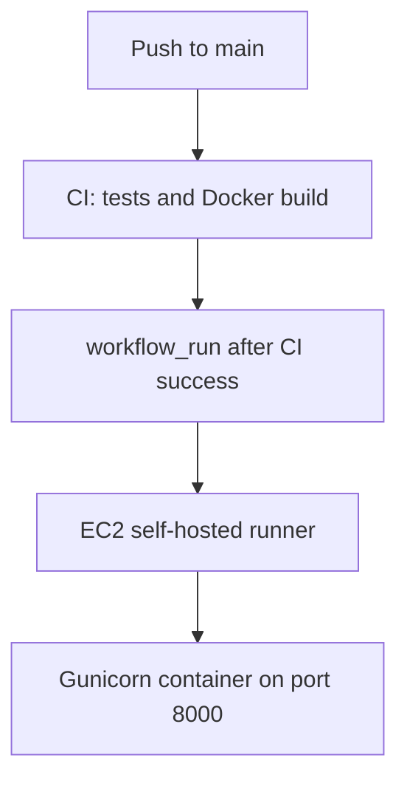

I separated the pipeline into two workflows:

1. **Continuous Integration** runs tests and verifies that the Docker image can be built.
2. **Continuous Deployment** starts only after the CI workflow completes successfully and deploys the tested commit through the EC2 self-hosted runner.

## API Endpoints

| Endpoint | Purpose |
|---|---|
| `/` | Displays the application name and available endpoints |
| `/health` | Returns the health status of the API |
| `/system` | Returns CPU, memory, disk, hostname, and uptime information |
| `/version` | Returns the Git commit associated with the deployed application version |

Example health response:

```json
{
  "status": "healthy"
}
```

Example system response:

```json
{
  "cpu_usage": 0.0,
  "disk_usage": 39.0,
  "hostname": "container-hostname",
  "memory_usage": 56.0,
  "uptime_seconds": 2017
}
```

The exact values from `/system` change depending on the container and host environment.

## Technologies Used

| Technology | How I Used It |
|---|---|
| Python | Application and test implementation |
| Flask | REST API routing and JSON responses |
| psutil | CPU, memory, disk, hostname, and uptime information |
| pytest | Automated endpoint testing |
| Gunicorn | Production WSGI server inside the container |
| Docker | Application packaging, isolation, and health checking |
| GitHub Actions | CI and CD workflow automation |
| GitHub-hosted runner | Running the CI job |
| Self-hosted runner | Running deployment commands directly on EC2 |
| Amazon EC2 | Temporary deployment host |
| Amazon EBS | EC2 root storage |
| AWS security groups | Restricting SSH and application access |
| GitHub Environments | Representing the Production deployment environment |

## Running the Project Locally

### Requirements

To run the project directly with Python:

- Python 3
- `pip`
- A Python virtual environment

To run the containerized version, Docker is essential.

### Python Setup

```bash
git clone https://github.com/Tahir-Alakbarli/System-Health-API.git
cd System-Health-API

python3 -m venv .venv
source .venv/bin/activate

python -m pip install --upgrade pip
pip install -r requirements.txt
```

### Run the Tests

```bash
pytest -v
```

### Run the Application with Gunicorn

```bash
gunicorn --bind 0.0.0.0:8000 Application.app:app
```

The API will be available at:

```text
http://localhost:8000
```

### Build and Run with Docker

```bash
docker build -t system-health-api:local .
```

```bash
docker run \
  --rm \
  --name System-Health-Container \
  -p 8000:8000 \
  system-health-api:local
```

I can then test the endpoints with:

```bash
curl http://localhost:8000/
curl http://localhost:8000/health
curl http://localhost:8000/system
curl http://localhost:8000/version
```

## Docker Configuration

I configured the Docker image to:

- Install only the required Python dependencies.
- Copy the application into the image.
- Run the application as a non-root user.
- Use Gunicorn as the application server.
- Listen on port `8000`.
- Include a Docker health check.
- Exclude tests, screenshots, Git metadata, caches, and unnecessary local files from the build context.

Running the application as a non-root user reduces the privileges available to the application inside the container.

## Continuous Integration

The CI workflow is located at:

```text
.github/workflows/ci.yml
```

The `test_and_build` job runs on a GitHub-hosted runner.

I configured it to validate the application before deployment by:

1. Checking out the repository.
2. Preparing the Python environment.
3. Installing the project dependencies.
4. Running the automated tests.
5. Building the Docker image.

If any required CI step fails, the workflow fails and the deployment workflow is not allowed to continue.

## Continuous Deployment

The CD workflow is located at:

```text
.github/workflows/cd.yml
```

I configured the deployment workflow to use GitHub Actions' `workflow_run` event. This means the deployment is connected to the result of the Continuous Integration workflow instead of deploying independently from an unverified push.

The `deploy_to_ec2` job used:

- The `Production` GitHub environment.
- An EC2-hosted self-hosted runner.
- The custom runner label `Deployment`.
- Docker installed directly on the EC2 host.
- A Docker image tagged with the tested Git commit.
- A health check after starting the new container.

The deployed `/version` endpoint returned the same commit identifier used by the deployment, allowing me to verify which revision was running.

## AWS Deployment Configuration

For the temporary deployment environment, I used:

| Setting | Value |
|---|---|
| AWS Region | `eu-central-1` |
| Operating system | Ubuntu 24.04 LTS |
| Instance type | `t3.micro` |
| Root storage | 10 GiB `gp3` EBS volume |
| Application port | `8000` |
| SSH port | `22` |
| Runner name | `GitHub-Actions-Runner` |
| Runner label | `Deployment` |
| GitHub environment | `Production` |
| Container name | `System-Health-Container` |

I tagged the EC2 instance with:

| Tag | Value |
|---|---|
| `Name` | `GitHub-Actions-Instance` |
| `Project` | `System-Health-API` |
| `Environment` | `Production` |
| `Owner` | `Tahir-Alakbarli` |

## Security Decisions

I applied the following security measures during deployment:

- I restricted SSH access on port `22` to my public IP address using a `/32` rule.
- I also restricted application access on port `8000` to my public IP address.
- Of Course, I did not commit the EC2 private key, runner registration token, AWS credentials, or environment files.
- Used a short-lived GitHub runner registration token.
- Ran the application as a non-root user inside the container.
- I used a GitHub environment for the production deployment job.
- At the same time, removed the self-hosted runner registration before destroying the server.
- Deleted the EC2 key pair and local private key after the deployment was no longer needed.
- I scanned the staged repository for common credential and private-key patterns before making it public.

## Deployment Evidence

### GitHub Actions Overview

Both CI and CD completed successfully.

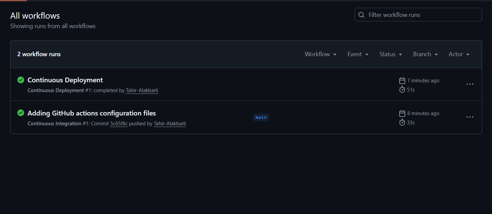

### Continuous Integration

The CI workflow successfully completed the testing and build process.

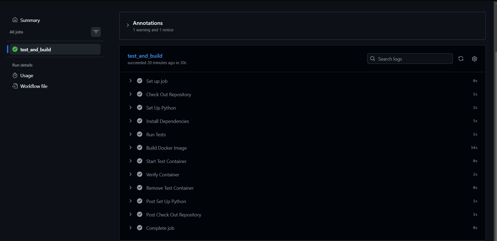

### Continuous Deployment

The CD workflow successfully deployed the application using the self-hosted runner.

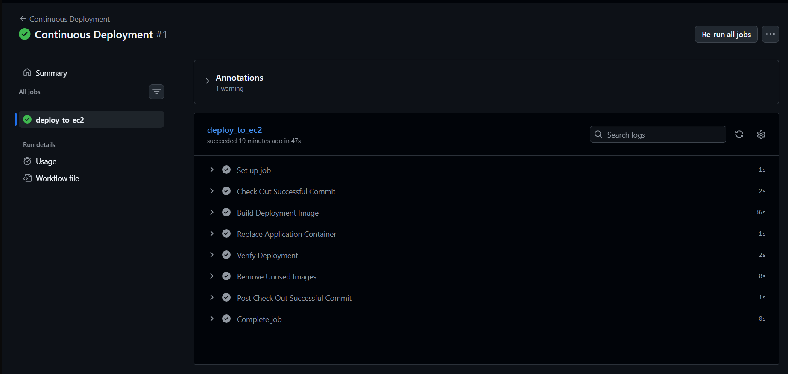

### Self-Hosted GitHub Actions Runner

The EC2 runner was registered with the `Deployment` label and was available to accept deployment jobs.

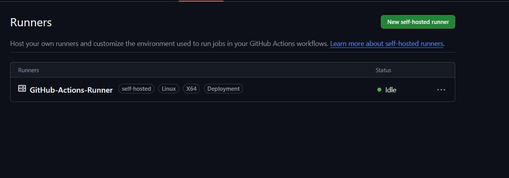

### Production Environment

I used a GitHub environment named `Production` for the deployment job.

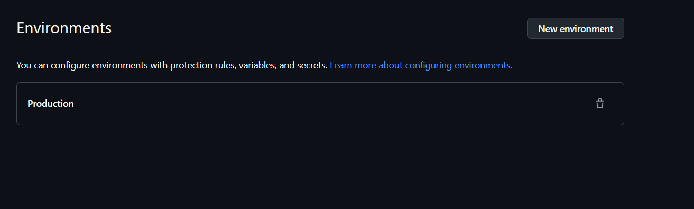

### EC2 Instance

The application was deployed to a running EC2 instance.

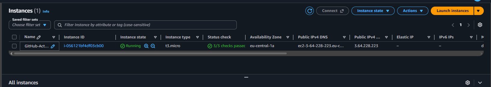

### EC2 Configuration

The instance used Ubuntu, a `t3.micro` instance type, a public IPv4 address, and IMDSv2.

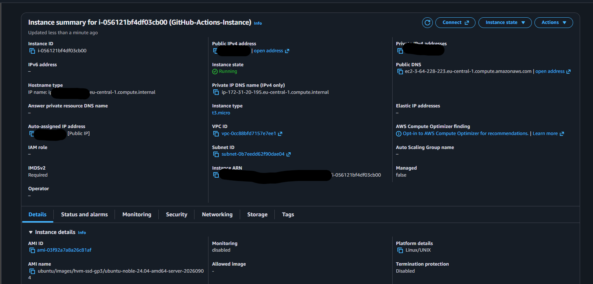

### EC2 Resource Tags

I added project, environment, name, and owner tags to make the resource identifiable.

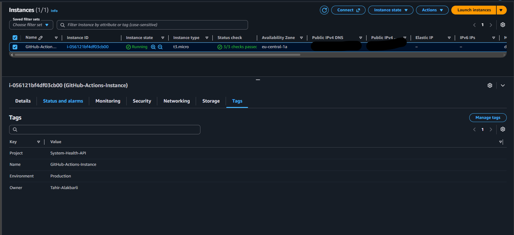

### Security Group

The security group allowed SSH and application traffic only from my public IP address.

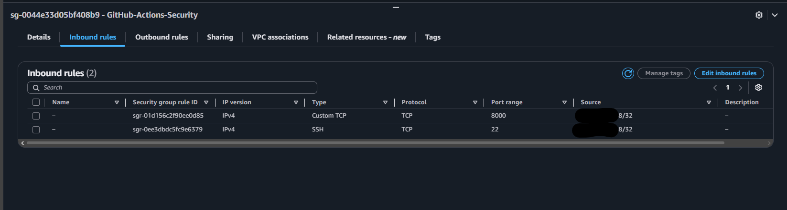

### General API Endpoint

The root endpoint displayed the application name and available routes.

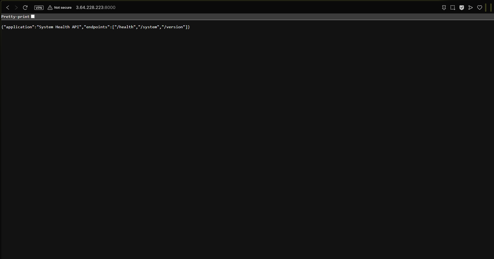

### Health Endpoint

The health endpoint confirmed that the deployed API was healthy.

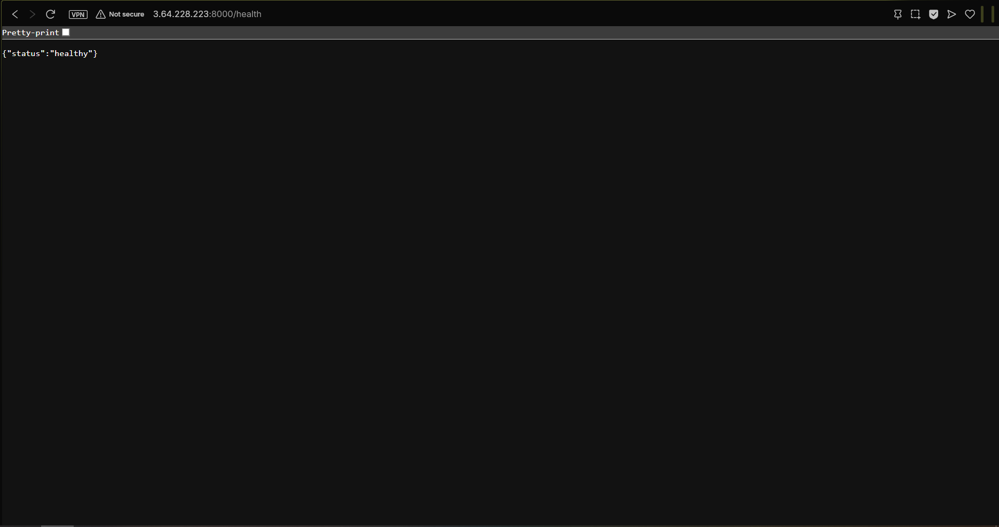

### System Utilization Endpoint

The system endpoint returned live utilization information from the container.

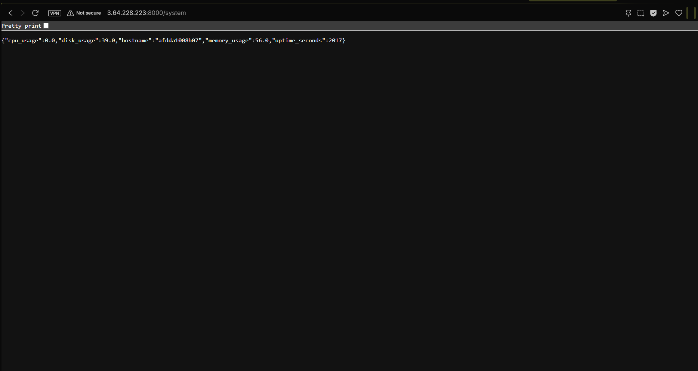

### Version Endpoint

The version endpoint identified the Git commit deployed inside the container.

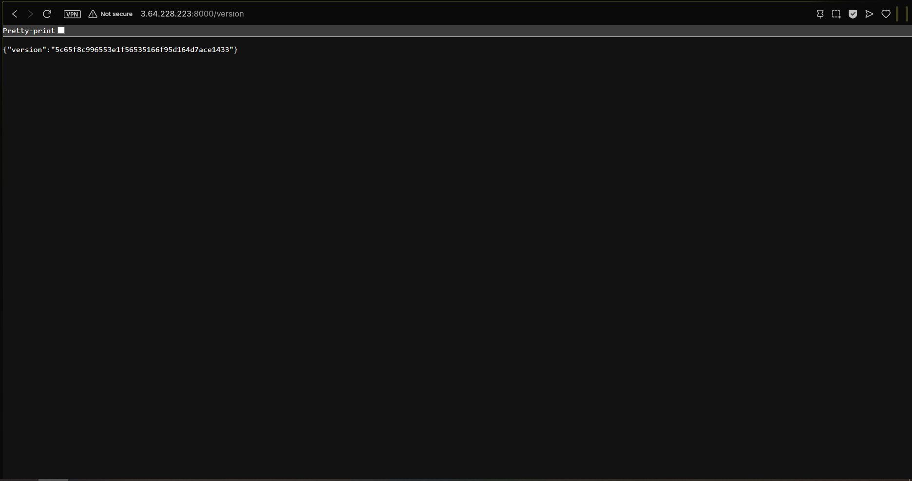

## Troubleshooting

### Self-Hosted Runner Registration Token

The most difficult problem I encountered was registering the self-hosted runner.

My first attempt resulted in:

```text
Invalid configuration provided for token
```

The runner registration token is short-lived and different from a normal GitHub personal access token. I generated a new repository runner-registration token through the GitHub API and configured the runner without displaying or committing the token.

After registration, I installed the runner as a `systemd` service so that it could continue running after I disconnected from SSH.

### Docker Permissions on EC2

After installing Docker, the Ubuntu user did not immediately have permission to communicate with the Docker daemon.

I added the user to the `docker` group and reconnected so that the new group membership would take effect. I then verified the installation with:

```bash
docker version
docker run --rm hello-world
```

### Correctly Targeting the Deployment Runner

The deployment job needed to run only on the EC2 runner.

I assigned the custom `Deployment` label during runner registration and matched that label in the CD workflow. I confirmed that GitHub displayed the runner as online before executing the deployment.

### Verifying the Deployed Revision

A successful workflow alone did not prove that the expected application revision was running.

I included the tested Git commit in the deployed image version and exposed it through `/version`. I then compared the endpoint response with the workflow commit.

### Safe AWS Cleanup

I wanted to ensure that the demonstration did not leave unnecessary billable resources behind.

I checked that the EBS root volume used `DeleteOnTermination`, terminated the EC2 instance, waited for the instance and volume deletion to complete, and then removed the project security group and key pair.

## Resource Cleanup

After documenting the successful deployment, I removed the temporary infrastructure.

I completed the following cleanup:

- Disabled both GitHub Actions workflows.
- Removed the self-hosted runner registration from GitHub.
- Terminated the EC2 instance.
- Confirmed deletion of the attached EBS root volume.
- Deleted the project security group.
- Deleted the EC2 key pair.

The GitHub `Production` environment remains in the repository because it does not create an AWS resource or generate an AWS infrastructure charge.

## Workflow Status

Both workflows are currently stored in the repository but are manually disabled.

I disabled them because the EC2 self-hosted runner and AWS infrastructure were intentionally removed after the demonstration. Leaving CD enabled without its runner would only cause deployment jobs to remain queued.

The workflows can be enabled again after someone prepares their own deployment environment:

```bash
gh workflow enable ci.yml
gh workflow enable cd.yml
```

Before enabling CD, the new environment must have:

- A Linux self-hosted GitHub Actions runner.
- Docker installed and running.
- The runner registered to the repository.
- A matching `Deployment` label.
- A GitHub environment named `Production`.
- Suitable firewall or security-group rules for the intended deployment.

Infrastructure provisioning is intentionally not automated by this repository. Anyone reusing the workflow is responsible for creating and securing their own deployment host.

## What I Learned

Through this project, I gained practical experience with:

- Separating CI and CD into independent workflows.
- Chaining workflows using `workflow_run`.
- Working with GitHub-hosted and self-hosted runners.
- Registering a runner as a persistent Linux service.
- Building commit-specific Docker images.
- Testing API endpoints and container health.
- Troubleshooting Linux user permissions and runner authentication.
- Restricting cloud network access.
- Confirming the exact application revision deployed.
- Cleaning up EC2, EBS, security-group, key-pair, runner, and local Docker resources.

## AI Usage

I used AI assistance for the most difficult troubleshooting and configuration decisions, particularly diagnosing the invalid self-hosted runner token and confirming a safe cleanup order for the runner, EC2 instance, EBS volume, security group, and key pair.

I performed the infrastructure configuration, command execution, testing, log inspection, endpoint verification, repository organization, and final cleanup myself.

## Sources

I used the following official documentation while building and troubleshooting the project:

### GitHub Actions

- [Workflow syntax for GitHub Actions](https://docs.github.com/en/actions/reference/workflows-and-actions/workflow-syntax)
- [Events that trigger workflows: workflow_run](https://docs.github.com/en/actions/reference/workflows-and-actions/events-that-trigger-workflows#workflow_run)
- [GitHub self-hosted runners](https://docs.github.com/en/actions/concepts/runners/self-hosted-runners)
- [Managing self-hosted runners](https://docs.github.com/en/actions/how-tos/manage-runners/self-hosted-runners)
- [Choosing the runner for a job](https://docs.github.com/en/actions/how-tos/write-workflows/choose-where-workflows-run/choose-the-runner-for-a-job)
- [Deployments and environments](https://docs.github.com/en/actions/reference/workflows-and-actions/deployments-and-environments)
- [GitHub CLI: disabling a workflow](https://cli.github.com/manual/gh_workflow_disable)
- [GitHub CLI: enabling a workflow](https://cli.github.com/manual/gh_workflow_enable)

### Docker

- [Dockerfile reference](https://docs.docker.com/reference/dockerfile/)
- [Building a Docker image](https://docs.docker.com/reference/cli/docker/image/build/)
- [Running a Docker container](https://docs.docker.com/reference/cli/docker/container/run/)

### Python Application

- [Flask documentation](https://flask.palletsprojects.com/en/stable/)
- [Deploying Flask to production](https://flask.palletsprojects.com/en/stable/deploying/)
- [Gunicorn documentation](https://gunicorn.org/)
- [Gunicorn quickstart](https://gunicorn.org/quickstart/)
- [psutil documentation](https://psutil.readthedocs.io/en/latest/)
- [pytest documentation](https://docs.pytest.org/en/stable/)

